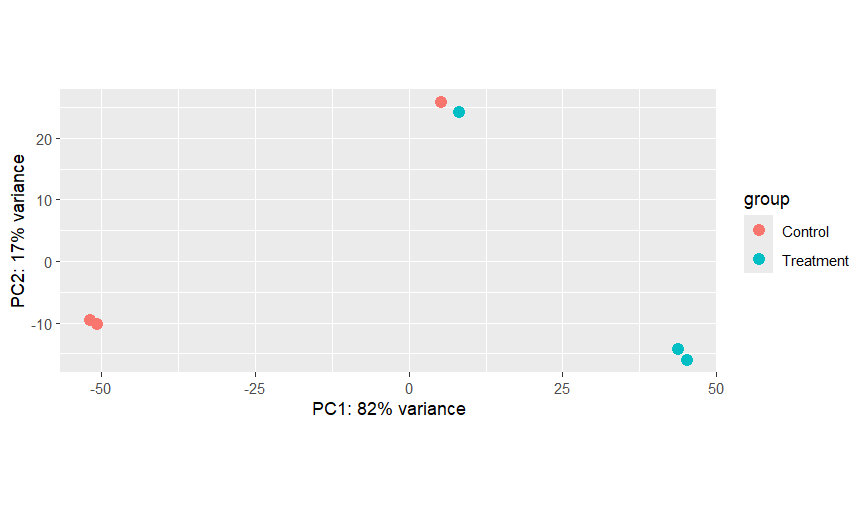
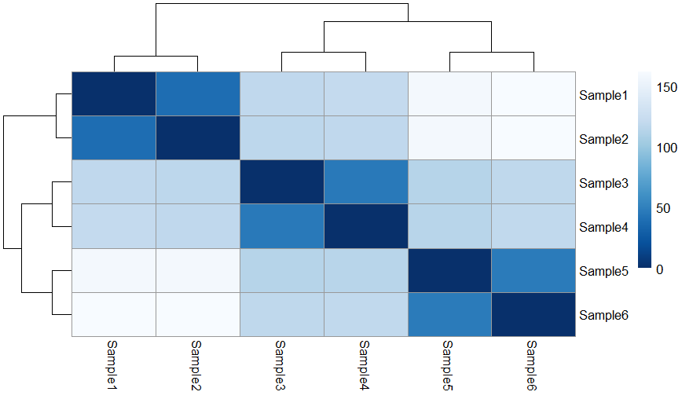
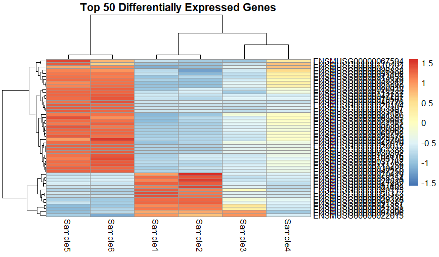
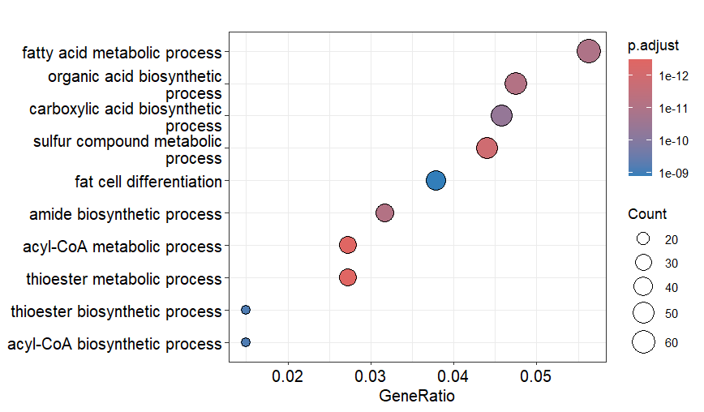
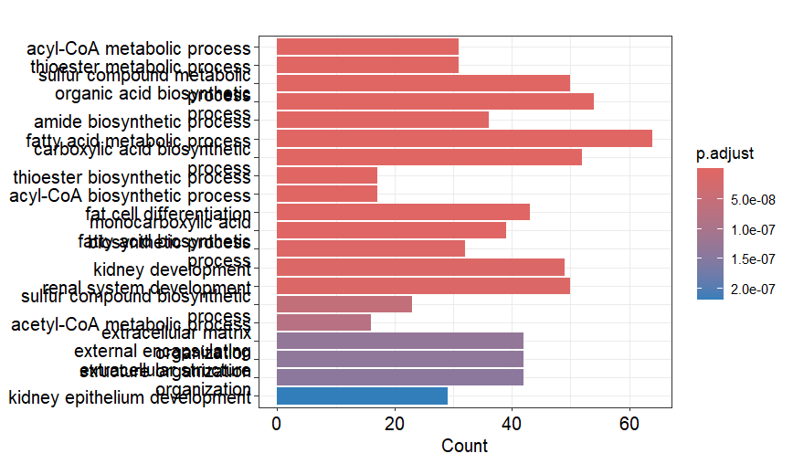
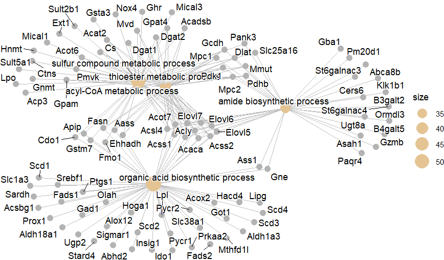
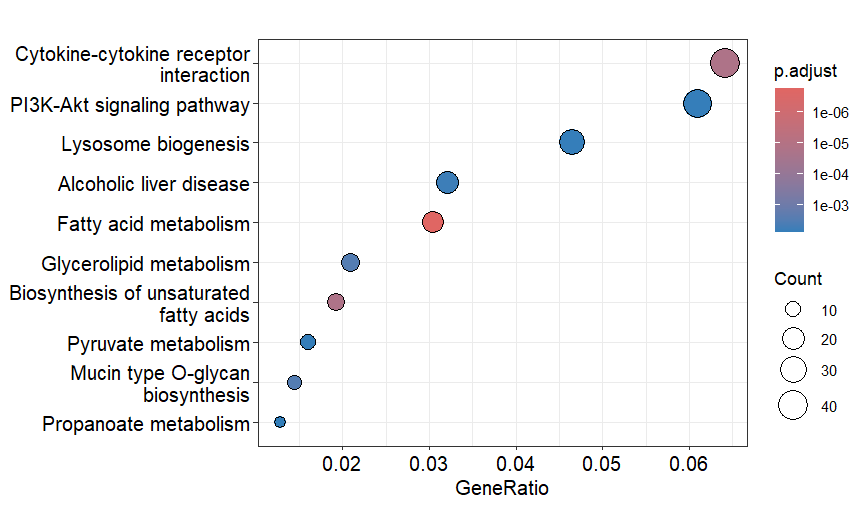
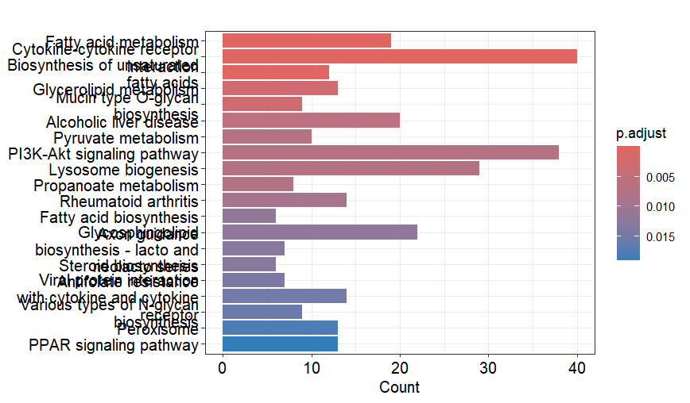
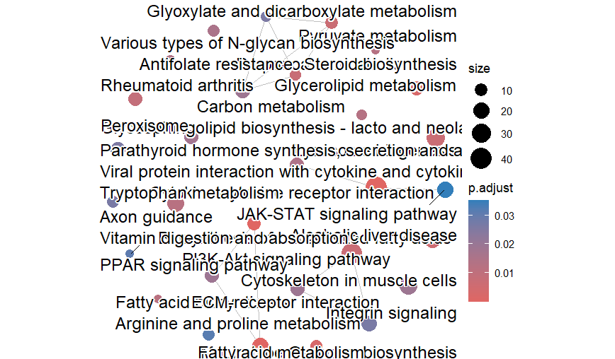
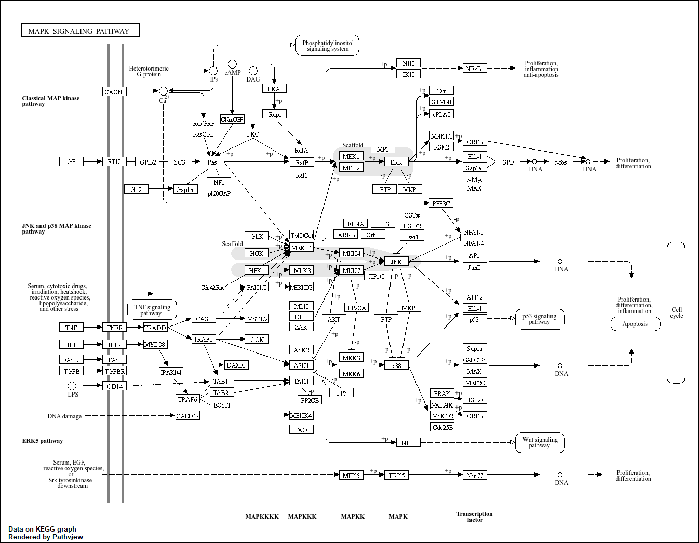

# 🧬 Mouse Breast Cancer RNA-Seq Analysis (GSE60450)

## 📌 Overview

This project performs a complete **Bulk RNA-Seq differential gene expression analysis** using the GEO dataset **GSE60450** from mouse breast cancer samples. The workflow includes quality control, read trimming, alignment, quantification, differential expression analysis, functional enrichment, and visualization.

---

## 📂 Dataset Information

* **Dataset:** GSE60450
* **Source:** NCBI GEO
* **Organism:** *Mus musculus* (Mouse)
* **Study Type:** Bulk RNA Sequencing
* **Conditions:** Control vs Tumor
* **Samples:** 6

---

## 🔬 Workflow

```text
FASTQ files
     ↓
FastQC
     ↓
Trimmomatic
     ↓
HISAT2 Alignment
     ↓
SAMtools
     ↓
FeatureCounts
     ↓
DESeq2
     ↓
Differential Expression Analysis
     ↓
GO & KEGG Enrichment Analysis
     ↓
Visualization
```

---

## 🛠 Tools and Software

| Tool            | Purpose                 |
| --------------- | ----------------------- |
| Linux           | Environment             |
| Bash            | Pipeline execution      |
| FastQC          | Quality control         |
| Trimmomatic     | Read trimming           |
| HISAT2          | Sequence alignment      |
| SAMtools        | BAM processing          |
| FeatureCounts   | Read quantification     |
| R               | Statistical analysis    |
| DESeq2          | Differential expression |
| clusterProfiler | GO and KEGG enrichment  |
| Pathview        | Pathway visualization   |
| ggplot2         | Plotting                |

---

## 📁 Repository Structure

```text
Mouse-Breast-Cancer-RNA-seq-GSE60450
│
├── scripts/
├── R_scripts/
├── counts/
├── data/
├── qc/
├── qc_trimmed/
├── figures/
├── results/
├── report/
├── README.md
└── GSE60450_DEGs.csv
```

---

# 📊 Differential Expression Analysis

Differential expression analysis was performed using **DESeq2** to identify genes significantly associated with breast cancer progression.

Output:

* Differentially expressed genes
* Fold change analysis
* Adjusted p-values
* Upregulated genes
* Downregulated genes

---

# 📈 Visualizations

## PCA Plot



---

## Sample Distance Heatmap



---

## Volcano Plot


---

## Top 50 Expressed Genes



---

## GO Enrichment Dot Plot



---

## GO Enrichment Bar Plot



---

## Enrichment Network Plot



---

## KEGG Dot Plot



---

## KEGG Bar Plot



---

## KEGG Pathway Visualization



---

## Pathview Visualization



---

# 📌 Key Findings

* Differentially expressed genes were identified between control and tumor samples.
* Principal Component Analysis (PCA) demonstrated clear separation between conditions.
* GO enrichment analysis revealed significantly enriched biological processes.
* KEGG pathway analysis identified cancer-related pathways.
* Pathview visualization mapped differentially expressed genes onto biological pathways.

---

# 💻 Technologies Used

* Linux
* Bash
* FastQC
* Trimmomatic
* HISAT2
* SAMtools
* FeatureCounts
* R
* DESeq2
* clusterProfiler
* Pathview
* ggplot2

---

# 🚀 Future Improvements

* Single-cell RNA-Seq analysis
* Gene Set Enrichment Analysis (GSEA)
* Survival analysis
* Protein-Protein Interaction Network analysis
* Machine learning-based biomarker discovery

---

# 👨‍💻 Author

### Manu Varun

B.Tech Bioinformatics
Vignan's Foundation for Science, Technology and Research (VFSTR)

### Connect with me

* GitHub: https://github.com/Manuvarun994
* LinkedIn: [www.linkedin.com/in/manu-varun-chekrapu-a6b0b2293](http://www.linkedin.com/in/manu-varun-chekrapu-a6b0b2293)

---

## ⭐ If you found this project useful, consider giving this repository a star!
